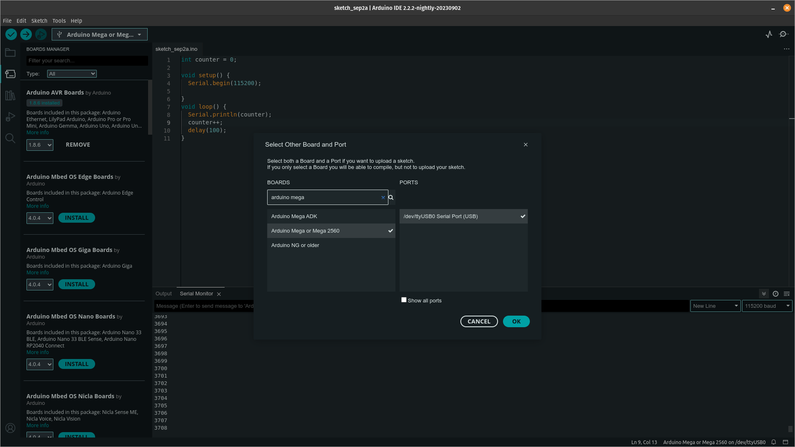

# Linux Config (Tested on Pop!_OS 22.04 LTS)

1. Download https://docs.arduino.cc/software/ide-v1/tutorials/Linux
2. sudo apt remove brltty
3. sudo usermod -a -G dialout $USER
4. Log out and log back in. You __MUST__ do this, otherwise Arduino-ide won't be able to talk to the board(Needed for loading code).

# Board Config(Board)

# To run:
1. Connect board

# Libraries used:

- https://github.com/thebigG/arduinoWebSockets